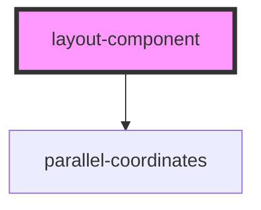

# my-component

<!-- Auto Generated Below -->

## Properties

| Property        | Attribute  | Description                                                                                 | Type       | Default     |
| --------------- | ---------- | ------------------------------------------------------------------------------------------- | ---------- | ----------- |
| `dataUrl`       | `data-url` | * Data url to fetch the csv file from. Should be relative to where the component is placed. | `any`      | `undefined` |
| `selectedRange` | --         |                                                                                             | `Object[]` | `undefined` |

## Dependencies

### Depends on

- [parallel-coordinates](../parallel-coordinates)

### Graph

----------------------------------------------

*Built with [StencilJS](https://stenciljs.com/)*
